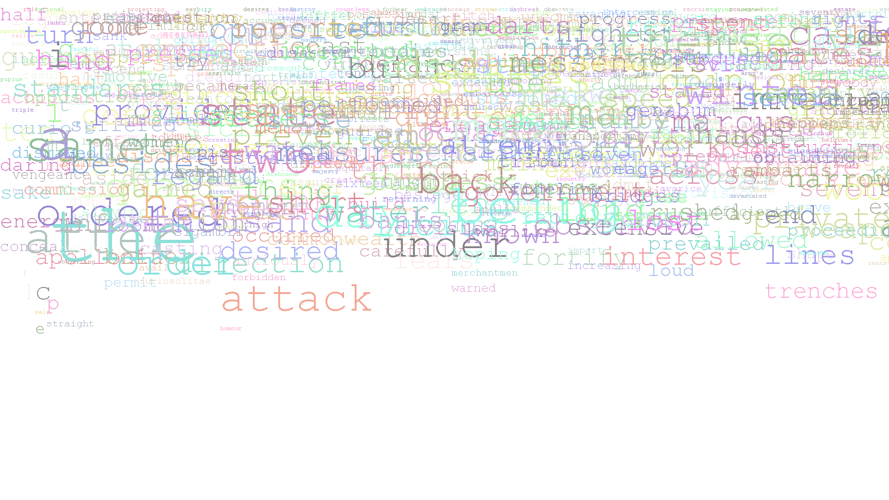
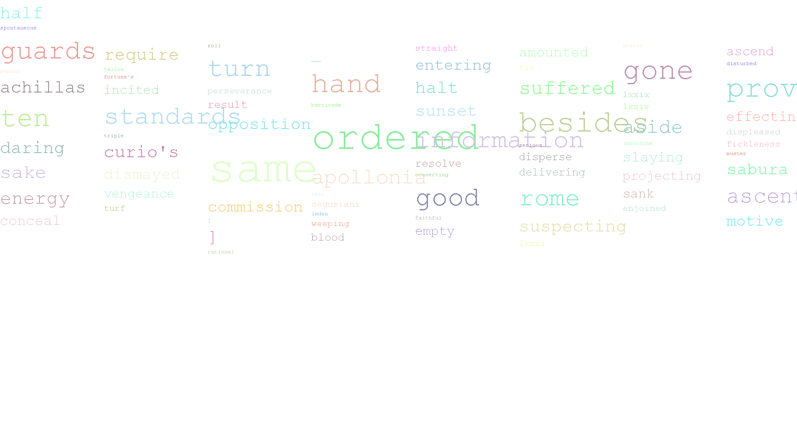
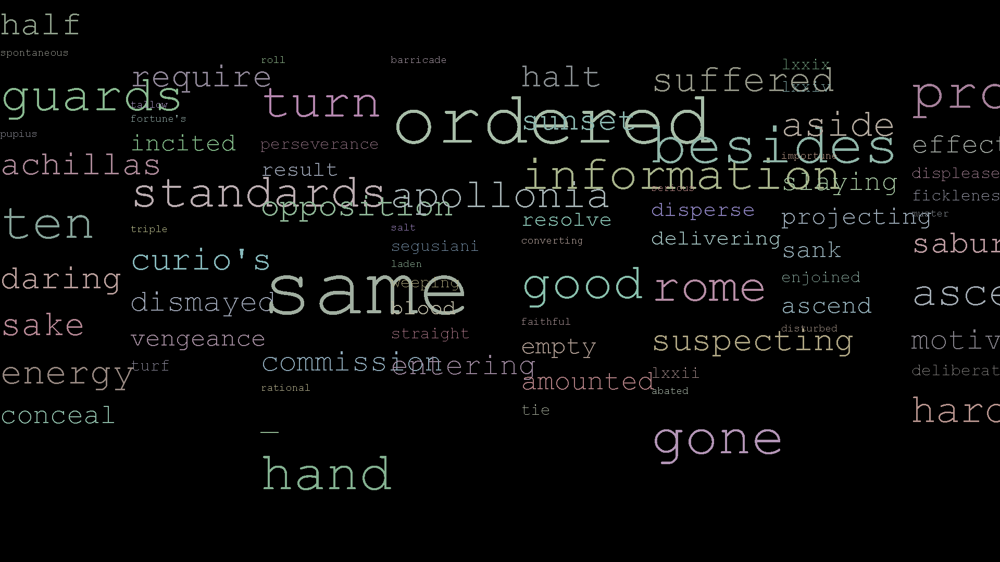

# Word Cloud Generator 

This is my submission for Data Structures and Algorithms project "Word Cloud".

For this project we had to create a visual representation of text using the users input of a URL or Text File Directory and the limit of words they would like to have displayed. The visual representation should also not include the ignored specified words which were taken from a file that is hardcoded into the program. The user must also be given the option to decide the name of the output file. 

## Getting Started

## Built With
*  [Eclipse](https://www.eclipse.org/) - The IDE used

## Acknowledgments
* Oracle.
* Java 8 doc's.
* Data Structures and Algorithms Lab Classes.
* StackOverflow when facing issues.

## Image IO Examples
* Here i will display a couple of different outputs of the Word Clouds as i progressed throughout the project.

* This screenshot was one of the first outputs of a Word Cloud i produced. 

* Second screenshot with a few tweaks.

* More tests.

