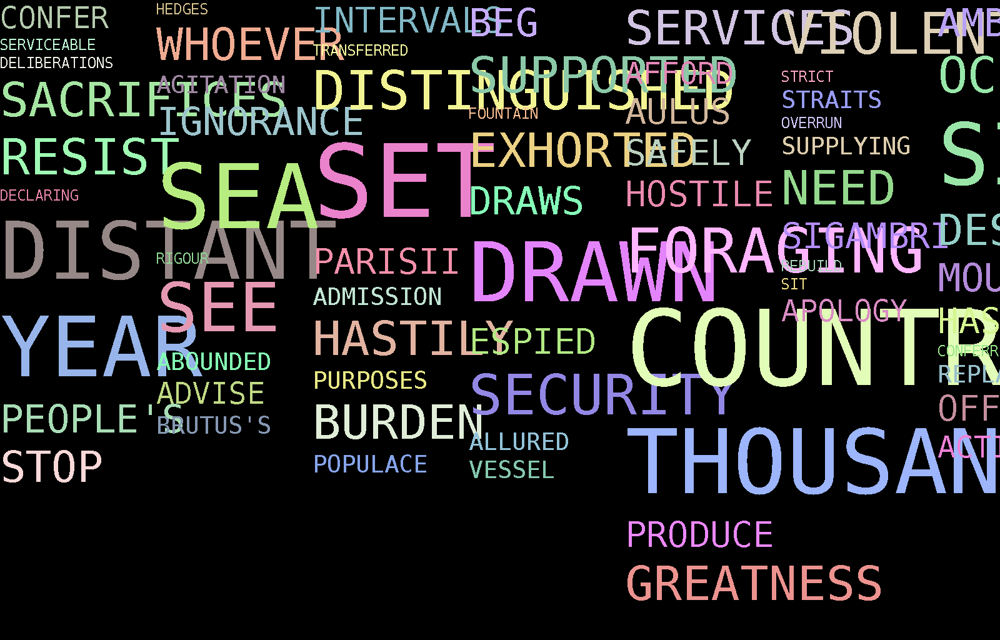

# Word Cloud Generator 


This is my submission for Data Structures and Algorithms project "Word Cloud".

For this project we had to create a visual representation of text using the users input of a URL or Text File Directory and the limit of words they would like to have displayed. The visual representation should also not include the ignored specified words which were taken from a file that is hardcoded into the program. The user must also be given the option to decide the name of the output file. 

## Built With
*  [Eclipse](https://www.eclipse.org/) - The IDE used

## Acknowledgments
* Oracle.
* Java 8 doc's.
* Data Structures and Algorithms Lab Classes.
* StackOverflow when facing issues.

## Running the Jar File
The JAR file has been created in the BIN location of the project. 
To run the JAR file on CMD/XTerm use the following commands :
```
java –cp ./wordcloud.jar ie.gmit.sw.Runner
```

## Runner
For the Runner file i just created a basic UI with a Menu allowing the user to choose between a File or URL or -1) To exit.
Whichever file type selection they chose would then direct them towards deciding how many words to display and the name they would like to name the image output file.

## Parser
For my File/URL Parser i used a HashMap<String, Integer> , This allowed me to implement the Frequency table later in the method which was a requirement in the brief of the project. The method would stream in the text file directory that had been entered and read through each String variable in the file and append it to the StringBuffer.


## Image IO Examples
* Here i will display a couple of different outputs of the Word Clouds as i progressed throughout the project.

* This screenshot was one of the first outputs of a Word Cloud i produced. 

* Second screenshot with a few tweaks.

